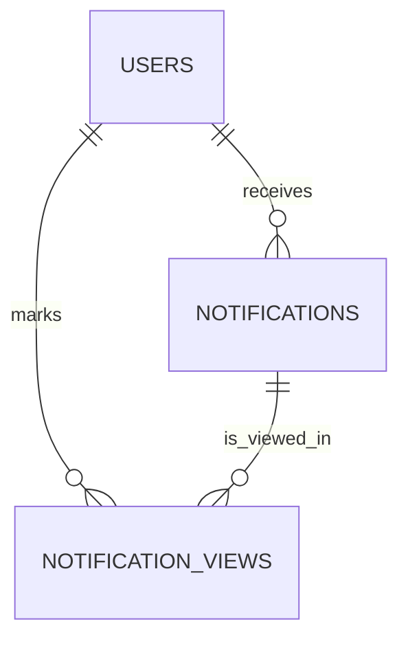

# Stage 2 — Database Design

## Goal
Design a normalized schema for notification storage and viewing history.

## Tables

### users
```sql
CREATE TABLE users (
  id UUID PRIMARY KEY,
  name TEXT NOT NULL,
  email TEXT NOT NULL UNIQUE,
  created_at TIMESTAMP NOT NULL DEFAULT NOW()
);
```

### notifications
```sql
CREATE TABLE notifications (
  id UUID PRIMARY KEY,
  user_id UUID NOT NULL REFERENCES users(id) ON DELETE CASCADE,
  type TEXT NOT NULL CHECK (type IN ('Placement', 'Result', 'Event')),
  message TEXT NOT NULL,
  created_at TIMESTAMP NOT NULL DEFAULT NOW()
);
```

### notification_views
```sql
CREATE TABLE notification_views (
  id UUID PRIMARY KEY,
  notification_id UUID NOT NULL REFERENCES notifications(id) ON DELETE CASCADE,
  user_id UUID NOT NULL REFERENCES users(id) ON DELETE CASCADE,
  viewed_at TIMESTAMP NOT NULL DEFAULT NOW(),
  UNIQUE (notification_id, user_id)
);
```

## Relationships
- One user can have many notifications.
- One notification can have many views.
- One user can mark many notifications as viewed.

## ER Diagram


## Indexing Strategy
```sql
CREATE INDEX idx_notifications_user_created ON notifications(user_id, created_at DESC);
CREATE INDEX idx_notification_views_user ON notification_views(user_id);
```
