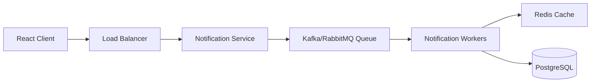

# Stage 5 — Reliable Notification Architecture

## Architecture

## Components
- Client: React app that displays notifications and priority inbox.
- Load Balancer: distributes traffic across API instances.
- Notification Service: handles create/read/update/delete operations.
- Queue: decouples message delivery from the API layer.
- Worker: processes delivery jobs and retries failures.
- Cache: stores hot notification lists.
- Database: persists notification payloads and read states.

## Scalability
- Add more worker instances behind the queue.
- Scale reads by using replicas or a read-through cache.

## Fault Tolerance
- Use retries with exponential backoff.
- Send failed jobs to a dead-letter queue.
- Persist the notification before dispatching it to the queue.

## Monitoring
- Track queue depth, retry count, API latency, and worker health.
- Alert on failures through Prometheus or Datadog.
